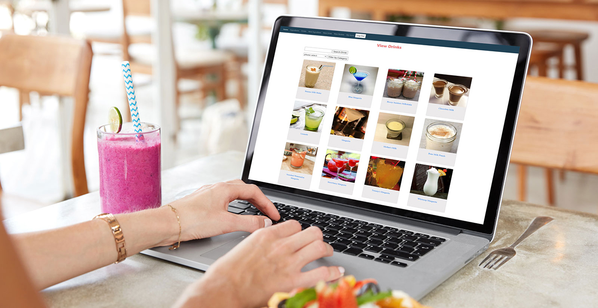

# 🍹Fun Drink Recipes App

### Drink recipe search resource and CRUD application equipped with search and filtering tools that optimize access to ingredients and categories.

The Fun Drink Recipe App is built with the Ruby on Rails framework. This web application is for drink lovers to find and create ingredients and recipes from cocktails to milkshakes. Users can also comment and rating on any ingredient. The app also provides name search and filter functionality. Enjoy🍷😊!

The third-party provider registrations was created with Omniauth, CSS styling with Bootstrap, and data from https://www.thecocktaildb.com/api.php.

## Features
* Parsed information from TheCocktailDB API with rest-client gem, and modeled custom database schema with Active Record, Ruby On Rails 
* Authenticated users at login by encrypting identifying account information via bcrypt gem
* Integrated users into my application with Google OAuth 

## Installation
Clone this repo to your local computer

Get to the directory `fun-drink-recipes (master)`

In your terminal: 

Run `bundle install`

Run `rails db:migrate`

Run `rails db:seed`

## Usage
Run `rails s` to start the server

Open your browser to localhost

## Contributing
Bug reports and pull requests are welcome on GitHub at https://github.com/lena0128/fun-drinks. This project is intended to be a safe, welcoming space for collaboration, and contributors are expected to adhere to the [code of conduct].

## License
The app is available as open source under the terms of the MIT License.